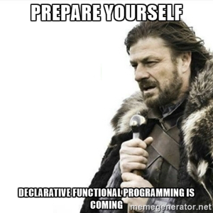
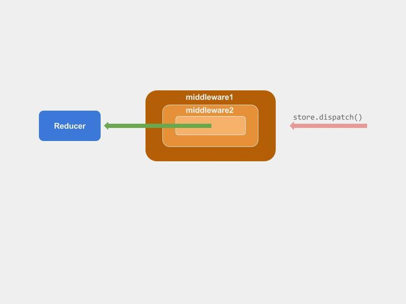
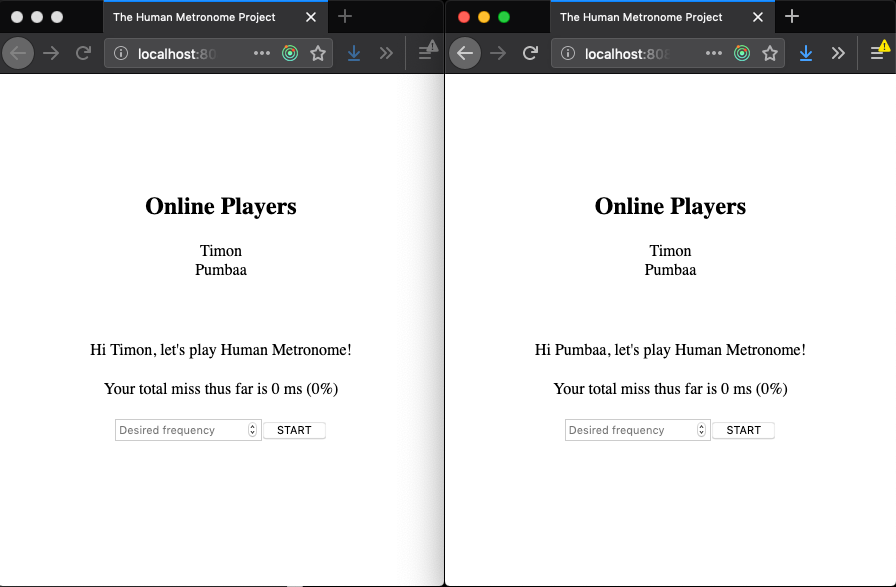
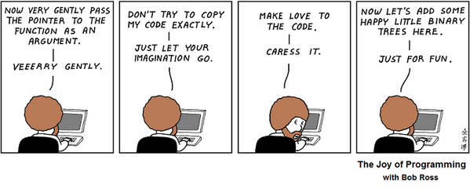

name: bidirectional
class: middle, center

# Interactive Front-end Development

## Urmas Talimaa
## _Glia Inc (formerly SaleMove)_

???

<!-- Dummy notes to check presenter display  -->

Presenter display slide notes

Pre-lecture checklist

* Switching between mirroring and non-mirroring works
* Unrelated tabs and windows closed or minimized
* Do not disturb mode **ON**
* Slides cloned, one has presenters mode on
* Dependencies installed and scripts are working for lecture example code
* Terminal(s) open with code and window to run scripts

---

# Litmus test for libraries/frameworks

* What are the basic abstractions? 
* How well do they **compose**?

---
 
# React/Redux

* Stateless React components
  * compose trivially through containment 
  * **no state**, no gotchas, no complexity
* Redux reducers
  * compose through namespacing/containment
  * **pure functions** are very simple to compose
 
---

# React/Redux

* React-Redux containers
  * Simple glue with selector functions
* Actions
  * Just interactions with context
* Middleware
  * Integration with a specific API
 
---

# React/Redux

* New abstractions or small helper functions are easy to write and integrate
because the core abstractions are pure functions

```js
(props) => pseudoHtml
```

```js
(action, previousState) => newState
```
 
---

# Why all this functional programming nonsense?

Can’t I just hack things together?

* No GoT spoilers please


.right-image[]

---

# Why all this functional programming nonsense?

* It **is not difficult** to hack together a prototype
* It **is difficult** to build maintainable software
  
---

# Middleware

Redux middleware is

...a third-party extension point between dispatching an action, and the moment it reaches the reducer

.full-image[]

.footer[_from [https://www.codementor.io/reactjs/tutorial/intro-to-react-redux-pros](https://www.codementor.io/reactjs/tutorial/intro-to-react-redux-pros)_]

---

# Communication with remote servers

* Async action creators (and middlewares) allow communication with remote servers using `fetch`
* `fetch` is **unidirectional**, server cannot make a request to the browser
  * e.g _You have one new message_
* Some web applications require **bidirectional** communication to push updates to the browser

---

# Long polling

* HTTP requests can be hacked to achieve bidirectional communication
* [https://en.wikipedia.org/wiki/Push_technology#Long_polling](https://en.wikipedia.org/wiki/Push_technology#Long_polling)

---

# Long polling

* Client sends request to Server
* Server keeps connection open (does not respond) until it has information to _push_ to the Client
* Client receives response from Server containing the pushed information
* Client immediately sends a new request to Server
* Rinse and repeat, connection kept open until user on page

---

# WebSockets

* All modern Web Browsers support
  [WebSockets](https://developer.mozilla.org/en-US/docs/Web/API/WebSocket)
  which is a saner alternative
* Note that simply polling (requesting data at an interval) is a valid
  simplification for many applications.

---

# WebSockets
   
* `connection.onopen = callback`

  connection between Client and Server is established
* `connection.onclose = callback`

  connection is closed by Server or Client or when connection is disrupted
* `connection.onmessage = callback`

  Client received messages pushed from Server
             
---

# WebSockets

* `connection.send(utf8String)`

   send string message to Server (binary messages also supported)
* `connection.close()`

   close connection from Client
             
---

# Websockets

.left-half[

Websockets (and web requests) are an epitome of mutable state.


You never know **what**, **if** and **when** is coming from them.


Put them under tight supervision, **do not** leak them all over our beautiful application code

]

.right-half[]

---

# Code example

[WebSockets comment server](https://github.com/urmastalimaa/interactive-frontend-development/tree/master/lecture_6)

---

# Testing WebSockets

* WebSocket connections are initiated using the WebSocket global
* WebSocket connections are inherently stateful
* This make testing WebSockets inconvenient.


Some libraries provide mock implementations of WebSocket global
([https://github.com/thoov/mock-socket](https://github.com/thoov/mock-socket))

---

# Testing WebSockets
  
Luckily we can put the WebSocket connection to a middleware and just map
received messages to action creators.

This encapsulates all WebSocket related logic, which itself is going to be
trivial.

---

# Encapsulating WebSockets using middleware

```js
// Using WebSocket abstraction from basic websocket example
export default (store) => (next) => {
  let connection = null;
  return (action) => {
    if (action.type === CONNECT) {
      connection = connectToWebSocket({
        parameters: {...},
        onOpen: () => store.dispatch(...),
        onClose: ({reason}) => store.dispatch(...),
        onMessage: ({eventName, payload}) => handleWebSocketMessage(store, eventName, payload)
      });
    } else if (action.type === DISCONNECT) {
      connection.close();
    } else {
      const pushAction = actionToWebSocketPush[action.type];
      if (pushAction) { pushAction(action.payload); }
    }
    return next(action);
  };
};
```

---

# My advisor on distributed systems

This is not a course on distributed systems, but...

.full-image[]

---

# Distributed systems

From the moment a remote Server is introduced, a distributed system is created

In a distributed system it is important to understand

* who **owns** (modifies and can be queried for) what information
* how updates are broadcasted / subscribed to
* what are the message delivery guarantees of communication channels

---

# Distributed systems

It is **very easy** to create an inconsistent system


Difficulting in retaining consistency increases when more moving parts are
added to a system (e.g multiple processes for load balancing/resiliency)

---

# Distributed systems

Before using any technology that can be _connected_ to

* HTTP requests,
* WebSockets,
* (NoSQL, relational) databases,
* etc

understand message **delivery and consistency guarantees**

---

# WebSocket delivery guarantees

* WebSockets use a single TCP connection,
* messages are guaranteed to arrive **in-order** and **exactly-once**
* as long as the connection is alive
* [https://tools.ietf.org/html/rfc6455](https://tools.ietf.org/html/rfc6455)


**As long as the connection is alive**

???

In practice connections are arbitrarily closed all the time

# Game Lobby discussion

Let’s say we add a new feature to the Game Lobby homework application


All players
* connect to a WebSocket server and
* one player can start 2 games concurrenctly
* only the player who started a game can close it
* any player can play along any game
* maximally 10 open games are allowed altogether

Detect potential problems in this distributed system


Bonus points available for each distinct issue with a **coherent** explanation

---

# Object updates with WebSockets

_Word of caution from personal experience_

When pushing updates about large objects (collections) it seems to be a good
idea to send _partial updates_ instead of whole objects

---

# Object updates with WebSockets

When integer set changes

1. {1,2,3}
2. {1,2,3,4}
3. {1,3,4}

Server sends
1. Initial: {1,2,3}
2. Add 4 
3. REMOVE 2

---

# Object updates with WebSockets

* As message order is guaranteed, such updates can be used to maintain the set

--

**Unless**

* Update handler encounters unexpected error client side
* Server encounters error sending update

---

# Object updates with WebSockets

**Unless**

* Connection drops and server doesn't re-send the whole object
* Connection drops and server starts loading the whole object (from database),
  but an update comes in just before it finishes and the client ends up missing the update


If anything fails, the maintained object is inconsistent **until user refreshes**

---

# Object updates with WebSockets

* The message order guarantee is only for a single WebSocket connection
* When building any protocol on top of the WebSocket connection this needs to be taken into account
* Try to use something that is battle-tested instead of homebrewing complex
  protocols on top of the (relatively) low level WebSocket API
* Or just send whole objects until you can...

---

# WebSocket request-response?

* WebSocket is a low level protocol
* It does not have request - response semantics
* It barely has any semantics at all.


* If you need it, don’t try to build it yourself
* [http://wamp-proto.org/](http://wamp-proto.org/)
* [https://www.npmjs.com/package/json-rpc2](https://www.npmjs.com/package/json-rpc2)

---

# Homework

* Deadline 05/05/2019 23:59
* Submit zipped file to https://courses.cs.ut.ee/2019/react/Main/Submit
* Make sure you follow Redux core principles
* **Only submit what is yours**

---

# Homework
              
.left-half[
  * [Requirements](https://github.com/urmastalimaa/interactive-frontend-development/blob/master/homework/thump/exercise6.md)
  * React - Redux are all about simple, reusable components. Make good use of that.
  * Tests are an inseparable part of your homework! Write them first (or at least together with each piece of code).
]

.right-half[]

---

# Homework

.full-image[]

---

.full-image[]

.footer[Courtesy of https://twitter.com/onquality/status/436608223240802304]
