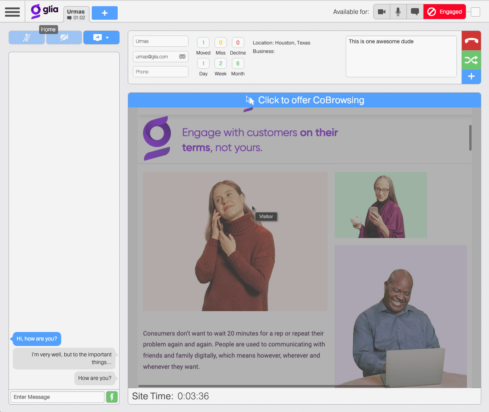

name: intro

class: middle, center

# Interactive Front-end Development

## Urmas Talimaa
## _Glia Inc (formerly SaleMove)_

???

<!-- Dummy notes to check presenter display  -->

Presenter display slide notes

Pre-lecture checklist

* Switching between mirroring and non-mirroring works
* Unrelated tabs and windows closed or minimized
* Do not disturb mode **ON**
* Slides cloned, one has presenters mode on
* Dependencies installed and scripts are working for lecture example code
* Terminal(s) open with code and window to run scripts

---

# History

* Started in spring 2016 by
  * Urmas Talimaa (Glia)
  * Stenver Jerkku (currently at eAgronom)
* Spring 2017-2018 by Urmas Talimaa
* This year Urmas Talimaa and maybe help from someone else

???

Three years of experience is not much, but it is something.

---

# About

* Student feedback says that the course is difficult
* Extensive **individual** programming homework
* Listeners are welcome, but their homework will not be reviewed
  * I just don't have the time

If you are not up to writing **code by youself** for 8 hours a week for 7 weeks
straight, please give someone else a chance to register.

---

# Who am I?

* Lead Developer at Glia
* Functional programming enthusiast
* Play Dungeons and Dragons weekly
* Love boardgames and nature

.right-image[]

---

# Teaching assistant Älli

.full-image[]

She will be grading the homework, so all direct all complaints to her.

---

# Glia

* Software company based in Tartu, Tallinn & New York
* Functional programming, Elixir, React+Redux
* Creating the future of on-line Customer Experience
* Hiring passionate people https://www.glia.com/careers

---

.full-image[]

---

# Course overview

* JavaScript crash course
  * Basic syntax
  * Ecosystem & tooling
* UI components using React
* Means of composition
* Testing, testing, testing
--

* Application state management using Redux
* Dealing with cross-cutting concerns using middleware
* Integration with external APIs
* Asynchronous code

---

# Course overview

* Understanding principles over hacking things together
* A lot of (unit) testing which will be graded
* Functional programming
* Composition of simple ideas

???

Simple ideas can be composed to produce complex system if the means of
composition are powerful, simple and flexible.

---

# Course overview

* Discussed ideas are not specific to the browser nor JavaScript
* For better or for worse, the Web is the most popular and accessible platform
* This necessitates some diving into the Web as a platform

---

# Calendar

A lot of work!

* 3 EAP = 78 hours
* 1 homework every week
* Good Friday week skipped
  * No lecture on April 19
  * No homework that week
* Final exam May 17

---

# Homework

* 7 homework, 10 points each
* Continuous software project
* First one given out today
* ~8 hours spent on each homework
* Hard deadline 23:59 the next Sunday (10 days)
  * Miss deadline = 10 points gone
* Catch-up application published Monday morning

???

The catch-up application is the only piece of code that can be used without
attribution. It is there to avoid people who fail to produce a good enough
solution one week from failing the whole course.

---

# Homework

* No hand holding!
* Message-board for support
  * I am one man, need your help answering questions
* A lot of reading and figuring things out from zero
* Straight to cold water!

---

# Homework

* Have something to show off in the end
* Buzzwords for resume

## Tips

* Stick to the deadline every week
* Code style matters!
* What cannot be understood, cannot be graded

---

# Homework

* I've had to deal with plagiarism **every year**
* I am **much better** at detecting plagiarism than you are trying to hide it
* It is not worth getting plagiarism on your record for an elective course

???

Reading other's code daily for 7 years has taught a lot.

---

# Homework

* Code from previous years of this course - **NO**
* Code from other students - **NO**
* Code that you found anywhere from the internet - **NO**
  * Only okay if it is a small snippet and properly attributed
* Getting a 0 for one homework and basing your next one on the catch-up
  application - **YES**

---

# Exam

* 30 points, multiple choice
* Will be simple if you attended all the lectures
* Exam result not required for final grade
* 51 points total = passed

---

# Communication

* Use message-board! https://www.quicktopic.com/52/H/Ys4Z7NJ6s4K4
* Sign up, **subscribe** and post questions and answers
* Best way to learn is to help others
* urmas.talimaa@gmail.com if message-board absolutely cannot be used

---

# Materials

* All materials including slides are available through the [course repository](https://github.com/urmastalimaa/interactive-frontend-development)
* The materials can be read in book format (links in top-level README.md) or
  through the GitHub interface
* There are _a lot of_ blogs and guides online
  * Blog quality varies wildly
  * Official documentation is best
