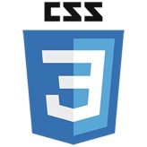
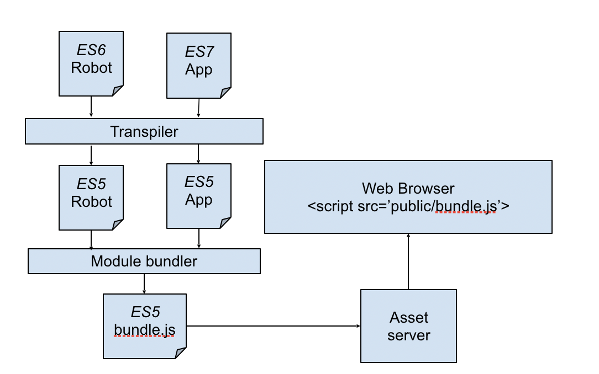
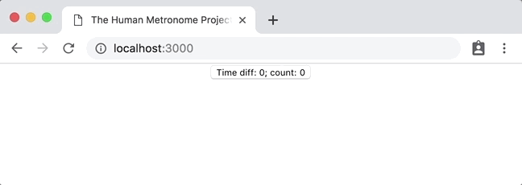

name: js_ecosystem
class: middle, center

# Interactive Front-end Development

## Urmas Talimaa
## _Glia Inc (formerly SaleMove)_

???

<!-- Dummy notes to check presenter display  -->

Presenter display slide notes

---

# Why build a JavaScript browser application?


* You probably don't need a JavaScript application for your web page
* Seriously, don't do this to yourself and your users
* Just use HTML and CSS
* Add minimal JavaScript when necessary (with fallbacks when JS disabled)

.horizontal_images[ ]

---

# Why build a JavaScript browser application?

* Make sure that you have an **application**
* An **interactive** application
	* that communicates with other entities
in _real time_

.right-image[]

???

Obviously not **real time**, but _soft_ real time

---

# Examples of websites that are not applications

* Your blog
* Your company's website
* Advertisement for a product
* Standard e-commerce site
* ...

---

# Examples of websites that could be applications

* Portal for playing chess
* Text editor 
* Anything that needs offline processing
* Anything that is extremely chatty

---

# Definitions

[_ECMAScript_ (ES)](https://en.wikipedia.org/wiki/ECMAScript) is a _versioned
language specification_ e.g ES5, ES6 ES7

_JavaScript_ is a _programming language_ (conforms to _ECMAScript_ spec)

???

Now we'll dive into what the ecosystem looks like and what tools we can use.
This part might be quite boring, but unfortunately cannot be skipped.
We'll not be dealing with the ecosystem in future lectures.

If at any point you have a question please feel free to interrupt.

---

# Definitions

There are other languages that conform to different _ECMAScript_ versions:
* _ActionScript_ (Flash)
* _TypeScript_ (typed _JavaScript_)

---

# Definitions

Different run-times for JavaScript

* _SpiderMonkey_ (Firefox)
* _V8_ (Chrome, Node.JS, MongoDB)
* _Chakra_ (Edge)


???

From now on we'll be talking mostly about JavaScript and different EcmaScript
versions to understand what syntax is available to us and why.

---

# Definitions

[Document Object Model
(DOM)](https://developer.mozilla.org/en-US/docs/Web/API/Document_Object_Model)
is an interface for programming HTML documents (also XML and SVG)

Can be used to interact with the document rendered in a web browser

---

# JavaScript Tooling

* Has historically changed extremely (too) fast
* Has become a bit more standardized in the last years
* [https://hackernoon.com/a-map-to-modern-javascript-development-2017-16d9eb86309c](https://hackernoon.com/a-map-to-modern-javascript-development-2017-16d9eb86309c)
* [https://github.com/addyosmani/es6-tools](https://github.com/addyosmani/es6-tools)
* We will choose one and stick with it

---

# JavaScript Tooling

Generally you have a **build tool**

that invokes a **transpiler** to transform source code to ES5-compliant JavaScript

and then calls a **module bundler** that gathers modules into one or more
JavaScript files that can be loaded in a browser.

JavaScript files are _during development_ served by a **development asset
server** which might also be providing **live reloading**.

User opens a browser and loads a HTML document and executes JavaScript.

---

# JavaScript Tooling

.full-image[]

---

# How to get libraries?

We'll use JavaScript to download some more JavaScript.

_Up to about half of the size of the Internet_

---

# NodeJS, JS in the backend

* In the beginning, JavaScript engines were limited to browsers
* NodeJS - run JavaScript everywhere!
* Everything that can be written in JavaScript will be (not that this is a good idea)
* NodeOS, PDFkit, Remote control for car, Online games, Collaborative drawing, etc
* Quality of libraries varies wildly (leaning towards dumpster level)
* No DOM as there is no HTML document
* `node app.js` // Evaluate app.js in NodeJS

---

# NodeJS, JS in the backend

* [https://nodejs.org/en/download/](https://nodejs.org/en/download/)
* Grab version 10.15.3 or later
* Will be used for building and testing our application and example code

---

# JavaScript Tooling - Packages

* Node Package Registry 
  * Both registry: [https://www.npmjs.com/](https://www.npmjs.com/)
  * And package manager [https://docs.npmjs.com/getting-started/what-is-npm](https://docs.npmjs.com/getting-started/what-is-npm)
* We'll be using a faster package manager: [Yarn](https://yarnpkg.com)
  * Uses same registry [https://www.npmjs.com/](https://www.npmjs.com/)
  * Package resolution algorithm is better and faster
* Both use the same manifest file: [package.json](https://yarnpkg.com/en/docs/package-json)

---

# JavaScript Tooling - Yarn

* Specify manifest and install libraries
* Specify an [allowed version range](https://github.com/npm/node-semver) for each library
* Versions (of most libraries) (try to) adhere to [semantic versioning](https://semver.org)
* Split production/development dependencies
* Project local packages are installed into `./node_modules` folder
* Exact versions are listed in [yarn.lock](https://yarnpkg.com/en/docs/yarn-lock)
* Can also install global packages to be used across system

---

# JavaScript Tooling - Yarn

[https://yarnpkg.com/en/docs/cli/](https://yarnpkg.com/en/docs/cli/)
* `yarn --help` - See all commands
* `yarn install` - Install all packages described in package.json
* `yarn add react` - Install react package and mark it as dependency in package.json
* `yarn add mocha --dev` - Install mocha package and mark it as devDependency in package.json.
* `yarn global add webpack` - Install webpack package globally - can be used from anywhere in the system

---

# ECMAScript 6 or ECMAScript 2015

* “New” javascript standard
* [Browser compatibility](https://kangax.github.io/compat-table/es6/) varies, can be used with a _transpiler_
* [https://github.com/lukehoban/es6features](https://github.com/lukehoban/es6features)

JavaScript in general has become fluid, different browser versions supporting
different features/syntax.

---

# ECMAScript 6 or ECMAScript 2015

* [Classes](https://developer.mozilla.org/en-US/docs/Web/JavaScript/Reference/Classes)  
	`class Foo extends Bar {..}`
* [Template literals](https://developer.mozilla.org/en-US/docs/Web/JavaScript/Reference/Template_literals)  
  `Hello ${name}`
* [Destructuring](https://developer.mozilla.org/en-US/docs/Web/JavaScript/Reference/Operators/Destructuring_assignment)  
	`var {op, lhs, rhs} = getASTNode()`
* [`let`](https://developer.mozilla.org/en-US/docs/Web/JavaScript/Reference/Statements/let) - block scoped variable
* [`const`](https://developer.mozilla.org/en-US/docs/Web/JavaScript/Reference/Statements/const) - **immutable** variables
* **modules**
* [Iterators](https://developer.mozilla.org/en-US/docs/Web/JavaScript/Guide/Iterators_and_Generators), [generators](https://developer.mozilla.org/en-US/docs/Web/JavaScript/Reference/Statements/function*)

---

# JavaScript Tooling - Modules

JavaScript runs in the browser, no native module system

[ES6 defines module syntax](https://developer.mozilla.org/en-US/docs/Web/JavaScript/Reference/Statements/import)

---

# JavaScript Tooling - Modules

* Named
  * `export Foo;`
  * `import {Foo} from './Foo';`
* Default
	* `export default Foo;`
	* `import Foo from './Foo';`

???

In lecture ignore this slide, go straight to example

---

# Example

[Building and modules using Webpack](https://github.com/urmastalimaa/interactive-frontend-development/blob/master/lecture_1/building.md#webpack)

???

Go over this example relatively fast

* Execute `yarn build`
* Open `index.html` to demonstrate application working
* Show `app.js` that modules are resolved in the final build

---

# JavaScript Tooling - Transpilers

_Compiling_: Transforming source code to a language on another level of abstraction (e.g from C to machine code)

_Transpiling_: Transforming source code to a language on a similar level of abstraction


---

# JavaScript Tooling - Transpilers

Write JavaScript how you want and have all the browsers running your code.
* [Babel](https://babeljs.io/)
* [Traceur](https://github.com/google/traceur-compiler)

Examples of languages that transpile to JavaScript (ES5):
* ES6
* TypeScript (~typed ES6)
* PureScript (haskell-like)
* ClojureScript (clojure-like)

---

# Example continued

[Building - Babel](https://github.com/urmastalimaa/interactive-frontend-development/blob/master/lecture_1/building.md#babel)

???

* Show babel config in webpack.config.js
* Show `class` definitions in final build with and without `IE10` in the
  browser list to demonstrate transpiling.

---

# Live reload

* Every time you need to change JS, you need to recompile
* Most build tools offer some sort of auto-reload mechanism
* Webpack dev server - [https://webpack.js.org/configuration/dev-server/](https://webpack.js.org/configuration/dev-server/)

---

.full-image[]

---

# Example continued

[Building - Webpack Dev Server](https://github.com/urmastalimaa/interactive-frontend-development/blob/master/lecture_1/building.md#refreshing-whenever-source-files-change)

???

This example should stress the importance of having a fast development loop

* Exectute `yarn start`
* Change some visible part of the app (e.g title) to show reloading
* Comment that this is highly more productive than manually building and reloading

---

# Source maps

A [source
map](https://www.html5rocks.com/en/tutorials/developertools/sourcemaps/) tells
the browser what the original source code looked like and how do the different
functions and classes map to the generated final file (app.js). Errors/console
statements point to lines in the source code instead of the generated file. It
greatly simplifies developing, especially when using transpiling.

Source maps need to be configured in the build tool.

[Building example continued - Source Maps](https://github.com/urmastalimaa/interactive-frontend-development/blob/master/lecture_1/building.md#source-maps)

???

Go straight to the example, leave descriptions for those not attending the lecture.

* Jump to source in the console logs to demonstrate source maps in effect
* Set a breakpoint in the source map and show that you can also debug through
the source map even though the final build is different

---

# CSS

* This course it not going to make you a designer
* Minimal usage of layout techniques is required
* Luckily *flexbox* makes things (more or less) easy
* [https://css-tricks.com/snippets/css/a-guide-to-flexbox/](https://css-tricks.com/snippets/css/a-guide-to-flexbox/)
* [http://flexboxfroggy.com/](http://flexboxfroggy.com/)

---

# Lint

* [Lint origin](https://en.wikipedia.org/wiki/Lint_(software)
* Detects problems before running unit tests or manual testing
* Can enforce style and formatting
* [Comparison of JavaScript linters](https://www.sitepoint.com/comparison-javascript-linting-tools/)
* [Linting code example](https://github.com/urmastalimaa/interactive-frontend-development/blob/master/lecture_1/linting.md)

???

Go straight to the example, leave descriptions for those not attending the lecture.

* execute `yarn lint`
* fix the failures and show why they matter
* stress that it is important to lint continuously
  * e.g through a `prestart` hook

---

# Unit tests

* Code that isn’t tested can’t be believed
* Manual verifications are inconsistent and take a long time
* Could have a separate course on how to write unit tests
* Code written using _functional programming_ is easier to test
	* Little to no setup required
	* Input and output clearly defined, no side effects

---

# Unit tests

* There are very many tools to run JavaScript tests
  * Some run tests in an actual browser
  * Some run them in NodeJS
  * Different defaults and configuration options
  * [Mocha](https://mochajs.org/) is simple and easy to start with
* There are also a variety of assertion libraries which simplify checking test results
	* [Chai](https://chaijs.com/) is pretty popular and integrates well with Mocha.

---

# Example

[Unit testing code example](https://github.com/urmastalimaa/interactive-frontend-development/blob/master/lecture_1/unit_tests.md)

???

Go straight to the example, leave descriptions for those not attending the lecture.

* Don't describe mocha & chai too much, say that the interfaces should be
explored as part of homework
* Stress that tests must also run continuously
* Always execute tests before packaging the homework for submission
* Code that isn't tested will assuredly break unexpectedly

---

# DOM manipulation

[https://developer.mozilla.org/en-US/docs/Web](https://developer.mozilla.org/en-US/docs/Web)

* `document.querySelector(cssSelector)`
  * Accepts [CSS Selectors](https://developer.mozilla.org/en-US/docs/Web/CSS/CSS_Selectors)
  * Returns first match or `null`
* `document.querySelectorAll(cssSelector)`
* `document.createElement(tagName)`
* `Element.appendChild(otherElement)`
* `Element.innerHTML = htmlString`
* `Element.onclick = myFunction;`

???

Don't stay on this slide too much

* Say that the exploring the exact details of these functions and interfaces
  are part of homework
* This is only necessary to perform homework 1
* A little exercise in reading documentation and combining lecture example code
  to build something on their own

---

# DOM manipulation

```js
const myDiv = document.querySelector('#my-div');
myDiv.innerHTML = 'my-text';

myDiv.onclick = function(){
	myDiv.innerHTML = 'clicked!';
};
```

---

# DOM manipulation

* DOM can only be manipulated when it has been parsed (_DOM is ready_)
* [Running your code at the right time](https://www.kirupa.com/html5/running_your_code_at_the_right_time.htm)
* `<script src="..." defer=true>` is the simplest option to **defer** JavaScript execution until DOM is ready

???

Skim through here, just a quick comment on that the HTML file is loaded
sequentally and it is important to wait until the whole document is evaluated
before trying to change it

---

# Running scripts using Yarn

* Don’t force user to install global packages before starting your web app
	* Also don’t expect them to know what exact tools in what configuration YOU used
* Define “scripts” for repeated actions in `package.json`

```json
	"scripts": {
		"test": "mocha ./test/",
		"start": "webpack-dev-server --open --config webpack.config.js"
	}
```

---

# Homework

[Requirements](https://github.com/urmastalimaa/interactive-frontend-development/blob/master/homework/thump/exercise1.md)

Deadline 24/03/2019 23:59

**Only submit what is yours**

Only assume NodeJS v10.15.3 is available locally and nothing else

Feel free to use tools other than described (provided they are installed with
`yarn install`), but don’t expect full support or less-strict grading if you do.

???

* It is not necessary to go through the requirements list fully.
* Just stress that it is important to read through **all** the requirements
* It is okay to combine lecture code, but you must understand it and pick only
  the necessary parts

---

# Homework

If you need to provide further information, include it in README.md.

Submit zipped file to [https://courses.cs.ut.ee/2019/react/Main/Submit](https://courses.cs.ut.ee/2019/react/Main/Submit)

Don’t include node_modules or .git/, .hg/, .svn/, make sure that your zipped
file size is reasonable

You can use/modify/extend [this script](https://gist.github.com/urmastalimaa/70edc0728cb711234f42) (usage: `node zipHomework.js`) to automate creating a zip file without specific folders.

---

# Homework result

.full-image[]
