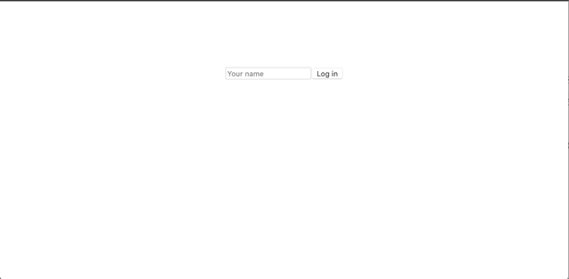

name: react_2
class: middle, center

# Interactive Front-end Development

## Urmas Talimaa
## _Glia Inc (formerly SaleMove)_

???

<!-- Dummy notes to check presenter display  -->

Presenter display slide notes

Pre-lecture checklist

* Switching between mirroring and non-mirroring works
* Unrelated tabs and windows closed or minimized
* Do not disturb mode **ON**
* Slides cloned, one has presenters mode on
* Dependencies installed and scripts are working for lecture example code
* Terminal(s) open with code and window to run scripts

---

#  React antipatterns

Avoid consecutive `setState` calls. Call it once with multiple key-value pairs.

```js
this.setState({
  results: this.state.results.concat({timeDiff, id: id + 1})
});
this.setState({
  allowMoreTries: false
});
```

vs

```js
this.setState({
  results: this.state.results.concat({timeDiff, id: id + 1}),
  allowMoreTries: false
});
```
  
---

# React antipatterns

```js
class MyComponent {
  myFunc() {
    this.props.onSubmit('foo', this.props.bar)
  }
// ...
}
```

What is wrong?
  
--

Parent already knows about bar, passing it to the callback gives unnecessary responsibilities to `MyComponent`
  
---

# Linting?

Quality code does not have

* unused vars
* inconsistent formatting
* arbitrary `console.log` statements

---

# Linting?

* They leave a bad impression about a product and by proxy - its creator
* I’d rather not make rules and deduct points for such noise when it is
  trivially avoidable
* **Use a linter**
  
---

# Thinking in React

More on concepts covered in previous seminar:
https://reactjs.org/docs/thinking-in-react.html
   
---

# Don’t let challenges weigh you down

.full-image[]
  
---

# Types of Components

In the end, it is all about state...

---

# Presentational Components

* Concerned with how things look
* Do not care about data flow
  * Receive data and callbacks exclusively through props
  * Can almost always be pure functions
  * Rarely have state
* Have no dependencies on other libraries/frameworks
  
---

# Presentational Components

* Trivially reusable 
  * Just pass different props
* Easy to test
  * Check whether it renders in all execution branches
* Composition of presentational components is a presentational component

---

# Forms

* Receive input from users
* Provide data to presentational components and/or external Services
* Have **local** state

---

# Container components

* Concerned with how things work
* Provide data to presentational components
* Are often stateful or interact with state-management libraries (Redux, Flux)
* Interact with external services
  
---

# Separation of concerns

* Presentational components display data
* Container components manage data
* Presentational components remain unchanged regardless of framework
* Not separating presentational and container components leads to the
standard problem: UI mixed with application logic

???

As previously noted, React is only a view library and it does not have built-in
support for creating a maintainable system for managing state.
  
---

# Types of components

[Code Example](https://github.com/urmastalimaa/interactive-frontend-development/blob/master/lecture_3/src/types_of_components/README.md)

Additional reading

* [https://gist.github.com/chantastic/fc9e3853464dffdb1e3c](https://gist.github.com/chantastic/fc9e3853464dffdb1e3c)
     
---

# React “Two-way data binding”

* HTML form elements (input, select, textarea) inherently hold state 
* [https://reactjs.org/docs/forms.html](https://reactjs.org/docs/forms.html)
* React offers two ways to deal with such elements
  * [Controlled components](https://reactjs.org/docs/forms.html#controlled-components)
  * [Uncontrolled components](https://reactjs.org/docs/uncontrolled-components.html)
     
---

# Controlled components

* State is fully synced between React and DOM
* Bind input value with Component state
* Change component state when input changes (onChange)
  
---

# Uncontrolled components

* React and DOM state not synced
* Do not bind element value to React state
* Get element value from DOM when required
  > (e.g when a related button clicked)


* Uncontrolled components can be easier to integrate with non-React code.
* Otherwise prefer controlled components to not have uncontrolled state.
 
---

# React Two-way data binding

[Code example](https://github.com/urmastalimaa/interactive-frontend-development/blob/master/lecture_3/src/types_of_components/README.md)
   
---

# Component lifecycle

* In addition to render and constructor, React provides hooks that are executed at different points in Component lifecycle
* Allows integration with external libraries
  * Set up external element when React component is mounted
  * Tear down when React component unmounted
* Allows side effects (e.g network requests or DOM focus) when component mounted/unmounted or props change
   
---

# Component lifecycle

* Diagram: http://projects.wojtekmaj.pl/react-lifecycle-methods-diagram/
* Documentation: https://reactjs.org/docs/react-component.html#the-component-lifecycle
    
---

# Testing React components

* Code that isn’t tested can’t be believed
* React elements need to be rendered somehow to assert their behaviour 
* [https://reactjs.org/docs/test-utils.html](https://reactjs.org/docs/test-utils.html)
* Official React docs suggest using [enzyme](https://github.com/airbnb/enzyme)
  * Enzyme simplifies traversing the component tree and asserting attributes of
    it
  * [Chai-enzyme](https://github.com/producthunt/chai-enzyme) can be used to
    have fluent expectations and informative error messages
     
---

# Shallow rendering

* Shallow rendering renders one Component layer
* Avoids unit testing child Components (test one thing at a time)
  * Does **not** execute any code paths in child Components
* Simplest way to unit test React components
* Fast
* [Enzyme shallow rendering API](https://github.com/airbnb/enzyme/blob/master/docs/api/shallow.md)

```js
import React from 'react';
import {shallow} from 'enzyme';
/* ... */
const myComponent = shallow(<MyComponent myProp={'foo'} />);
```

---
     
# Static rendering

* Static rendering renders only markup (HTML) without interacting with an
  actual DOM
* Renders whole component tree
* Useful for asserting specific HTML structure or testing nested
Components
* [Enzyme static rendering API](https://github.com/airbnb/enzyme/blob/master/docs/api/render.md)

```js
import React from 'react';
import {render} from 'enzyme';
/* ... */
  const myComponent = render(<MyComponent myProp={'foo'} />);
  expect(myComponent.html()).to.eql("...");
```

---
     
# DOM rendering

* DOM rendering requires a full DOM API to be present and renders React
  components as it would in an actual browser
* Requires a headless browser implementation in NodeJS like
  [jsdom](https://github.com/tmpvar/jsdom)
* Renders whole component tree
* Useful for testing specific DOM functionality that can not be simulated
* [Enzyme full DOM rendering API](https://github.com/airbnb/enzyme/blob/master/docs/api/mount.md)

```js
import React from 'react';
import {mount} from 'enzyme';
/* ... */
const myComponent = mount(<MyComponent myProp={'foo'} />);
```
 
---

# Simulating events

* Events in actual DOM can propagate (bubble)
* When rendering components to an actual DOM, events can be simulated
using DOM APIs
  * Such events propagate and have all the attributes that they have in browser
* DOM APIs are not available when using shallow rendering. Events can be
  simulated by calling the appropriate callbacks (e.g `onClick`, `onChange`)
  * Such events do not propagate and can miss attributes that would be present
    in browser
  * Enzyme adds
    [`simulate`](https://github.com/airbnb/enzyme/blob/master/docs/api/ShallowWrapper/simulate.md)
    function to selected elements that essentially does the same
   
---

# React testing example

[Code example](https://github.com/urmastalimaa/interactive-frontend-development/blob/master/lecture_3/test/README.md)

---
   
# Debugging in Browser

* Developer console allows you to assign variables, run functions, set
  breakpoints etc
* To stop JavaScript evaluation at a certain point
  * Add `debugger;` statement to source code (you can obviously only do this in
    development)
  * Set a breakpoint in Developer tools (source maps can help find desired
    line)
* Learn Developer tools for your favorite browser, it is an invaluable skill 
  * [https://developer.chrome.com/devtools](https://developer.chrome.com/devtools)
  * [https://developer.mozilla.org/son/docs/Tools](https://developer.mozilla.org/son/docs/Tools)
     
---

# Debugging in Browser

[Code example](https://github.com/urmastalimaa/interactive-frontend-development/blob/master/lecture_3/src/debugging/README.md)
   
---

# Debugging in NodeJS

* Unit tests can be ran in NodeJS
* How to debug confusing errors?
* `--inspect` instructs NodeJS to allow attaching Chrome DevTools to Node.js
* `--inspect-brk` will break on the first line of application
  * Allows for setting further breakpoints through source maps

These features are mostly experimental and change often. Consult latest
documentation.

[https://nodejs.org/en/docs/guides/debugging-getting-started/](https://nodejs.org/en/docs/guides/debugging-getting-started/)
  
---

# Debugging Mocha tests using Chrome Dev Tools

* `mocha --inspect-brk`
* Open chrome://inspect and select the device
* Other integrations (including Visual Studio, WebStorm) [are
  available](https://nodejs.org/en/docs/guides/debugging-getting-started/#inspector-clients)
* Execution breaks on first line (hit continue or set breakpoints)
* Execution breaks on every breakpoint/`debugger`;
   
---

# Debugging Mocha tests

[Code example](https://github.com/urmastalimaa/interactive-frontend-development/blob/master/lecture_3/test/README.md)
   
---

# Testing callbacks

* How to use create callback functions and assert if and with what arguments
  they are called?
* Use stubs/mocks 
* [http://sinonjs.org/](http://sinonjs.org/)
* Integrates with chai using [https://github.com/domenic/sinon-chai](https://github.com/domenic/sinon-chai)
    
---

# Testing callbacks

```js
const onClick = sinon.stub();
const button = shallow(<button onClick={() => onClick('foo')} />);

button.simulate('click');

expect(onClick.calledWith('foo')).to.be.true // sinon + chai
expect(onClick).to.have.been.calledWith('foo'); // sinon-chai
```
  
---

# Stub callback example

[Code example](https://github.com/urmastalimaa/interactive-frontend-development/blob/master/lecture_3/test/components/CommentFormTest.js#L45)
   
---

# Homework

[Requirements](https://github.com/urmastalimaa/interactive-frontend-development/blob/master/homework/thump/exercise3.md)

* Deadline 07/04/2019 23:59
* Submit zipped file to https://courses.cs.ut.ee/2019/react/Main/Submit
* React tests are the focal point of this homework, they make up most of the
  grade
* **Only submit what is yours**

---

.full-image[]
