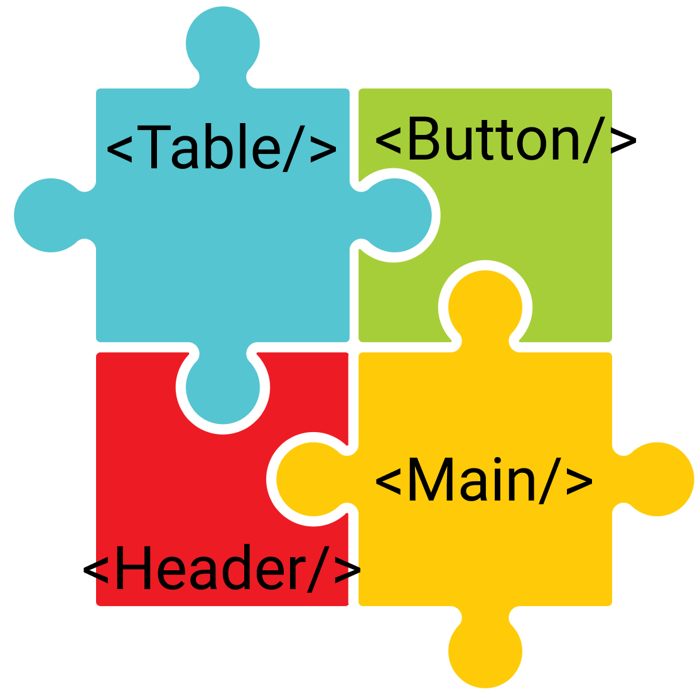
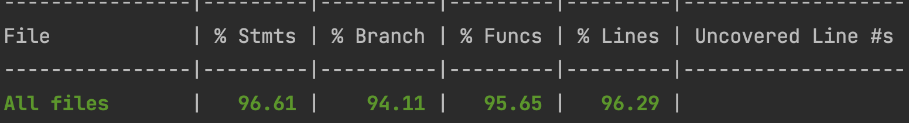

name: react_intro
class: cols, middle, main

.fifty.main-left[
# Interactive Front-end Development

by Artem Halas and Stanislav Deviatykh
]
.fifty.main-right[.main-circle[].secondary-circle[]]

???

Presenter display slide notes

Pre-lecture checklist

* Switching between mirroring and non-mirroring works
* Unrelated tabs and windows closed or minimized
* Do not disturb mode **ON**
* Slides cloned, one has presenters mode on
* Dependencies installed and scripts are working for lecture example code
* Terminal(s) open with code and window to run scripts

---

# Linting?

Quality code does not have

* unused vars
* inconsistent formatting
* arbitrary `console.log` statements

---

# Linting?

* They leave a bad impression about a product and by proxy - its creator
* I’d rather not make rules and deduct points for such noise when it is
  trivially avoidable
* **Use a linter**
* **Use a formatter** ([e.g. Prettier](https://prettier.io/docs/en/install.html))
  
---

# Types of Components

.cols[
.fifty[
In the end, it is all about state...
]
.fifty[
.full-image[]
]
]

---

# Stateless views

* Concerned with how things look
* Do not care about data flow
  * Receive data and callbacks exclusively through props
  * Can almost always be pure functions
  * Rarely have state
* Have no dependencies on other libraries/frameworks

```jsx
function Button({variant = "primary", onClick, children}) {
  return <button 
            className={`button__${variant}`}
            onClick={onClick}>
                {children}
        </button>
}
```
---

# Stateless views

* Trivially reusable 
  * Just pass different props
* Easy to test
  * Check whether it renders in all execution branches
* Composition of stateless views is itself a stateless view

---

# Forms

* Receive input from users
* Have **local** state concerning current form state
* Pass data to parent components ⬆️

```jsx
function InputForm({value='', type='text', onChange}) {
    const [localValue, setLocalValue] = useState(value);
    
    const localOnChange = (event) => {
        const v = event.target.value;
        setLocalValue(v);
        onChange(v);
    }
    
    
    return <input type={type}
                  value={localValue} 
                  onChange={localOnChange}/>
}
```

---

# Application logic containers

* Provide data to presentational components
* Pass data from forms to application logic to progress application state
* May interact with external services
* Always have state
  
---
# Application logic containers

```jsx
function ApplicationContainer() {
  const [inputState, setInputState] = useState('');
  
  const onChange = (value) => setInputState(value);
  
  const onClick = () => {
      fetch('/v1/form', {
          method: 'POST', 
          body: {
              name: inputState
          }
      });
  }

  return <section>
        <InputForm value={inputState} onChange={onChange}/>
        <Button onClick={onClick}>Submit</Button>
    </section>
}
```

---

# Separation of concerns

* Let views just display data
* Application logic containers should not handle UI concerns
* Alas, React components are not well suited to host application logic
  * Testing through UI is difficult and wasteful
  * Application logic should not concern itself with a specific view library
* What gives?

???

As previously noted, React is mostly just a view library.

---
# React inverse data-flow

* HTML form elements (input, select, textarea) inherently hold state 
* [https://reactjs.org/docs/forms.html](https://reactjs.org/docs/forms.html)
* [https://beta.reactjs.org/apis/usestate#examples-objects](https://beta.reactjs.org/apis/usestate#examples-objects)
* React offers a few ways to deal with such elements
  * [Controlled components](https://reactjs.org/docs/forms.html#controlled-components)
  * [Uncontrolled components](https://reactjs.org/docs/uncontrolled-components.html)
     
---

# Controlled components

* State is fully synced between React and DOM
* Bind input value with component state
* Change component state when input changes (onChange)
  
---

# Uncontrolled components

* React and DOM state not synced
* Do not bind element value to React state
* Get element value from DOM when required
  > (e.g. when a submit button is clicked)
* Uncontrolled components can be simpler
* Usually prefer controlled components to _capture_ all the state
 
---

## React Hooks

[https://reactjs.org/docs/hooks-reference.html](https://reactjs.org/docs/hooks-reference.html)

.cols[
.fifty[
### Basic
- `useState`
- `useEffect`
- `useContext`
]
.fifty[
### Additional
- `useCallback`
- `useRef`
- `useMemo`
- `useReducer`
- `useImperativeHandle`
- `useLayoutEffect`
- `useDebugValue`
]
]
---
# Basic Hooks

```jsx
const [number, setNumber] = useState(3); 
```
--
Runs **everytime** if number is changed

```jsx
useEffect(() => {
    if (number > 5) {
        console.log(number)
    }
}, [number])
```
--
Runs **only** once on component initiate or removed

```jsx
useEffect(
    () => console.log('Initial Load'),
    return () => console.log('Component Removed'); 
[]);
```
---
# Advanced Hooks

```jsx
const memoized = useCallback(
        () => console.log('Do not reinit variable')
, [])
```
--
```jsx
const memoized = useMemo(() => fibonachi(n), [n])
```
---
# Advanced Hooks

```jsx
const elementRef = useRef(null);
const inputValue = elementRef.current.value;

<input ref={elementRef} />
```
---
# Custom Hooks

- allows you to create any hooks what you wish
- could use any hooks into another hook
- move out business logic out of component


--
```jsx
const useAmazing = () => {
    useEffect(() => {
      console.log('You are amazing ✨')
    }, [])
}
```

---
# Hooks by example

[Example](../lecture_3/src/hooks_example/App.js)

---
# Component lifecycle

* In addition to render and constructor, React provides hooks that are executed at different points in component lifecycle
* Allows integration with externals
  * Create an external element when React component is mounted, e.g. using another library or framework
  * Update the external element when props or state change
  * Remote the external element from DOM when React component unmounted
* Allows side effects (e.g network requests or DOM focus) when component is mounted/unmounted or props change
   
---

# Component lifecycle

* Documentation: https://reactjs.org/docs/react-component.html#the-component-lifecycle
    
---
# Testing
.full-image[]

---
.full-image[]
---
# Testing React components

* Code that isn’t tested can’t be believed
* React elements need to be rendered somehow to assert their behaviour 
* [https://reactjs.org/docs/testing.html](https://reactjs.org/docs/testing.html)
* We'll be using [React Testing Library](https://testing-library.com/docs/react-testing-library/intro/)
     
---
# Why React Testing Library

* It strongly encourages writing _accessible_ UIs
* It is not brittle as it renders the component to an actual DOM
* Drawback: It requires a [headless DOM](https://github.com/jsdom/jsdom) to be setup for running tests in NodeJS

```jsx
import { render } from "@testing-library/react";

render(<MyComponent myText={'foo'} />);

expect(screen.getByText('foo')).toBeInTheDocument();
```

---
# User events

* Trigger events just as in an actual web browser
* Use helper functions to ensure that all necessary DOM events are triggered
  * _In what order are keyup, keydown, keypress, change triggered?_
  * The helper function from `user-event` knows

```js
import userEvent from "@testing-library/user-event";

userEvent.type(screen.getByRole("textbox", { name: "Author" }), "foo");
```
   
---
# React testing example

[Code example](https://github.com/urmastalimaa/interactive-frontend-development/blob/master/lecture_3/test/README.md)

---
# Debugging in Browser

* Developer console allows you to assign variables, run functions, set
  breakpoints etc
* To stop JavaScript evaluation at a certain point
  * Add `debugger;` statement to source code (you can obviously only do this in
    development)
* Learn Developer tools for your favorite browser, it is an invaluable skill 
  * [https://developer.chrome.com/devtools](https://developer.chrome.com/devtools)
  * [https://developer.mozilla.org/son/docs/Tools](https://developer.mozilla.org/son/docs/Tools)
     
---

# Debugging in Browser

[Code example](https://github.com/urmastalimaa/interactive-frontend-development/blob/master/lecture_3/src/debugging/README.md)
   
---

# Debugging in NodeJS

* Unit tests can be ran in NodeJS
* How to debug confusing errors?
* `--inspect` instructs NodeJS to allow attaching Chrome DevTools to Node.js
* `--inspect-brk` will break on the first line of application

These features are mostly experimental and change often. Consult latest
documentation.

[https://nodejs.org/en/docs/guides/debugging-getting-started/](https://nodejs.org/en/docs/guides/debugging-getting-started/)
  
---

# Debugging Jest tests using Chrome Dev Tools

* `node --inspect-brk node_modules/.bin/jest --runInBand`
* Open chrome://inspect and select the device
* Other integrations (including Visual Studio, WebStorm) [are
  available](https://nodejs.org/en/docs/guides/debugging-getting-started/#inspector-clients)
* Execution breaks on first line (hit continue or set breakpoints)
* Execution breaks on every breakpoint/`debugger`;
   
---

# Debugging Jest tests

[Code example](https://github.com/urmastalimaa/interactive-frontend-development/blob/master/lecture_3/test/README.md)
   
---

# Testing callbacks

* How to use create callback functions and assert if and with what arguments
  they are called?
* Use stubs/mocks
* [Jest mock functions](https://jestjs.io/docs/mock-functions)
    
---

# Testing callbacks

```js
const onClick = jest.fn();
const button = render(<button onClick={() => onClick('foo')} />);

userEvent.click(button);

expect(onClick).toHaveBeenCalledWith('foo');
```
---
# Homework

[Requirements](https://github.com/urmastalimaa/interactive-frontend-development/blob/master/homework/weather/exercise3.md)

* Deadline 20/03/2021 23:59
* Submit zipped file to https://courses.cs.ut.ee/2022/react/Main/Submit
* React tests are a focal point of this homework, omitting them loses a lot of points
* **Only submit what is yours**

.full-image[]

---

<video width="100%" height="50%" controls>
  <source src="assets/lecture-3/hw-3.mp4" type="video/mp4">
  Your browser does not support the video tag.
</video> 
