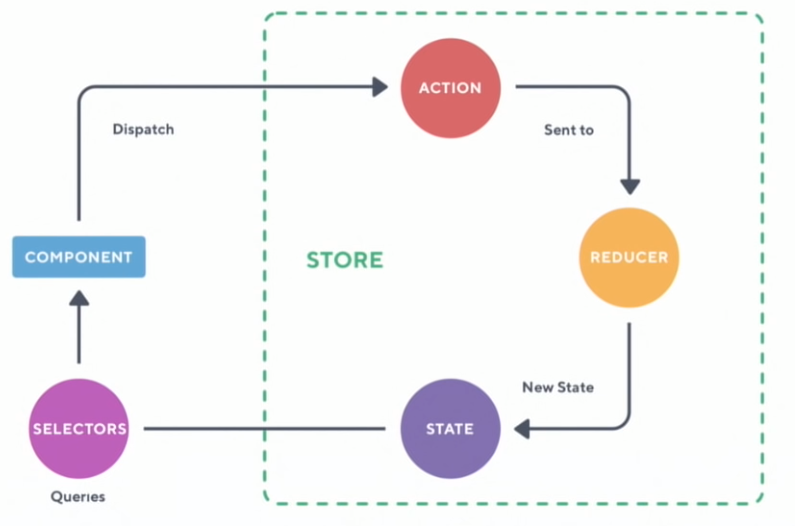

name: react_visual_testing
class: cols, middle, main

.fifty.main-left[
# Interactive Front-end Development

by Artem Halas and Stanislav Deviatykh
]
.fifty.main-right[.main-circle[].secondary-circle[]]

???

Presenter display slide notes

Pre-lecture checklist

* Switching between mirroring and non-mirroring works
* Unrelated tabs and windows closed or minimized
* Do not disturb mode **ON**
* Slides cloned, one has presenters mode on
* Dependencies installed and scripts are working for lecture example code
* Terminal(s) open with code and window to run scripts

---
    
# Developing React Component Look and Feel

When adding a React Component to a non-trivial application it is not feasible to

1. Start up the application
2. Manipulate application to achieve state required for Component
3. Make changes to the Component
4. Reload and repeat from step 2

---
 
# Developing React Component Look and Feel

* Unit tests (which can be run very fast in watch mode) only help to verify
  that the functionality of the Component works

---

# Developing React Component Look and Feel
 
Idea:

* Create a React application with only one component
* Develop the application in ordinary fashion - using a browser

---

# Developing React Component Look and Feel
 
Note that for this to work without much effort, the tested components

* should not have complex dependencies (ideally only require props as input),
* should not have complex state

---
 
# React Storybook

One implementation of this idea is React Storybook

.left-half[]

.right-half[[Docs](https://storybook.js.org/docs/react/get-started/introduction)]

---

# React Storybook

* Allows declaring stories
* A story is a rendering of a single component in a particular state
* Stories can be viewed and switched through a convenient interface
* Story reloads automatically on component changes
* Components in stories can be configured on the fly

---
   
# React Storybook

[Code example](https://github.com/urmastalimaa/interactive-frontend-development/blob/master/lecture_8/README-storybook.md)

---
# Visual tests?

There are various tools that test website visuals
* Some spin up actual browsers and take screenshots
* Some verify visual properties (`20px <= height <= 30px`)

---
# Visual tests?

Include tests in the build-chain

When going with an actual browser + screenshot approach, it is usually better
to offload running such tests to a Continuous Integration (CI) machine.

---
# Visual tests!
  
Using full application for visual tests is hard to set-up and maintain

* Stories for components 
* Tests isolated components visuals
* Simple creation and maintenance of visual tests

---
# Pull request diff example

Designers will eat this up

.full-image[]

---
# E2E tests

End to end tests are testing full flow of application

.left-half[
* Spin up browser
* Click on button
* Wait for response, etc
]

.full-image[]

---
# E2E tests

* Expensive
* Long execution time
* Fragile

---

# Redux

.full-image[]

---
# Redux

It is about time we made a Redux application!

[Code example](https://github.com/urmastalimaa/interactive-frontend-development/blob/master/lecture_8/src/components/ReduxApp.js)

---
# Thanks for hanging on

I hope you

* learned something
* had a bit of fun
* got angry at least once (need to have some emotion to be memorable)

---
# Thanks for hanging on

You now have an idea about techniques for building arbitrary user interfaces

Actual projects are never clean examples, but good guidelines nudge towards a
maintainable application

---
# Front end development

* Often regarded as an afterthought - just hack it together
* Front-ends tend to influence back-end design
* Front-end applications need logs and error reports too
* Just because it is JavaScript does not mean that the code should be garbage

---
# Front end development

* Keep it **simple**

  Composition! Pure functions!

* Keep it **declarative**

  Easy to read and understand!

* Keep it **testable**

  Less bugs!

---
# Front end development

* Keep it **traceable**

  Logs! Reproducible behaviour!

* Keep **concerns separated**

  Business logic, presentation

---
# Exam

* **Offline** exam with a homework-like exercise
* 26.05 16:15-18:00 - Please try to use this one, let me know if you absolutely
  cannot make it.
* 02.06 16:15-18:00 - Let me know if you absolutely need this timeslot

---
# Exam

* Start from existing project scaffold
* Implement a bit of functionality
* Only React usage is graded
* Tests are not mandatory

---
# Exam

* Very similar to the lecture "Comment" application and to your homework

Revise

* React component design - passing props, conditional rendering
* Callbacks
* Links and history-API based routing
* Don't have to use reducers if you don't want to, but need to ensure that you
  are **not directly mutating** state or props

---
# Exam

Example ticket:

* Get data from the server, and display it
* Navigate to separate page
* Modify data in state
