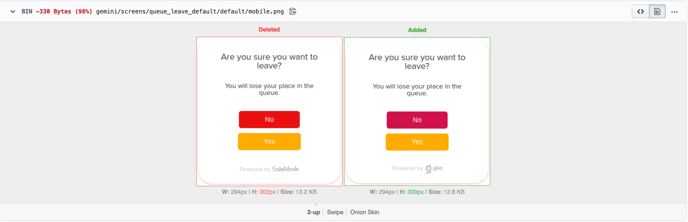

name: react_visual_testing
class: middle, center

# Interactive Front-end Development

## Urmas Talimaa
## _Glia Inc (formerly SaleMove)_

???

<!-- Dummy notes to check presenter display  -->

Presenter display slide notes

Pre-lecture checklist

* Switching between mirroring and non-mirroring works
* Unrelated tabs and windows closed or minimized
* Do not disturb mode **ON**
* Slides cloned, one has presenters mode on
* Dependencies installed and scripts are working for lecture example code
* Terminal(s) open with code and window to run scripts

---
    
# Developing React Component Look and Feel

When adding a React Component to a non-trivial application it is not feasible to

1. Start up the application
2. Manipulate application to achieve state required for Component
3. Make changes to the Component
4. Reload and repeat from step 2

---
 
# Developing React Component Look and Feel

* Unit tests (which can be run very fast in watch mode) only help to verify
  that the functionality of the Component works

---

# Developing React Component Look and Feel
 
Idea:

* Create a React application with only one component
* Develop the application in ordinary fashion - using a browser

---

# Developing React Component Look and Feel
 
Note that for this to work seamlessly

* Components should be separated from business logic (they should be _presentational_ components)
* Components should not have complex dependencies
(ideally only require props as input)
* Components should not have complex state

---
 
# React Storybook

One implementation of this idea is React Storybook 

* [Repository](https://github.com/storybooks/storybook)
* [Docs](https://storybook.js.org)

---

# React Storybook

* Allows declaring stories
* A story is a rendering of a single component in a particular state
* Stories can be viewed and switched through a convenient interface
* Story reloads automatically on component changes

---
   
# React Storybook

[Code example](https://github.com/urmastalimaa/interactive-frontend-development/blob/master/lecture_8/README-storybook.md)

---
  
# Visual tests?

There are various tools that test website visuals
* Some spin up actual browsers and take screenshots
* Some verify visual properties (`20px <= height <= 30px`)

---
  
# Visual tests?

Include tests in the build-chain

When going with an actual browser + screenshot approach, it is usually better
to offload running such tests to a Continuous Integration (CI) machine.

---

# Visual tests!
  
Using full application for visual tests is hard to set-up and maintain

* Stories for components 
* Tests isolated components visuals
* Simple creation and maintenance of visual tests

---

# Pull request diff example

Designers will eat this up

.full-image[]
